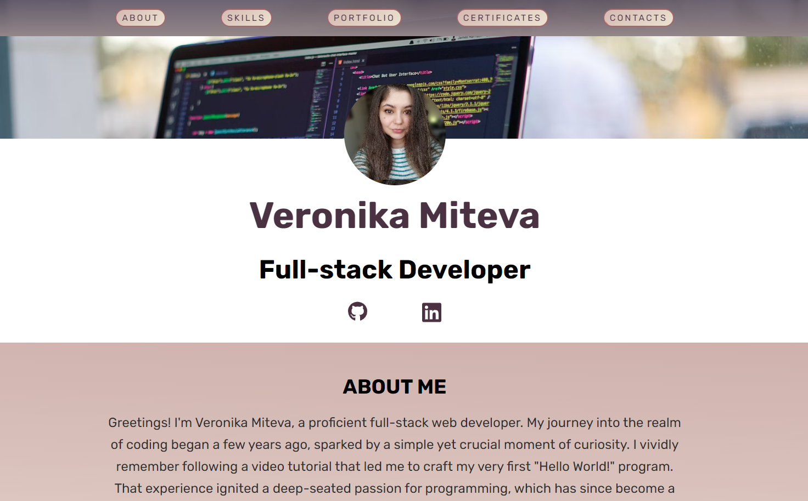
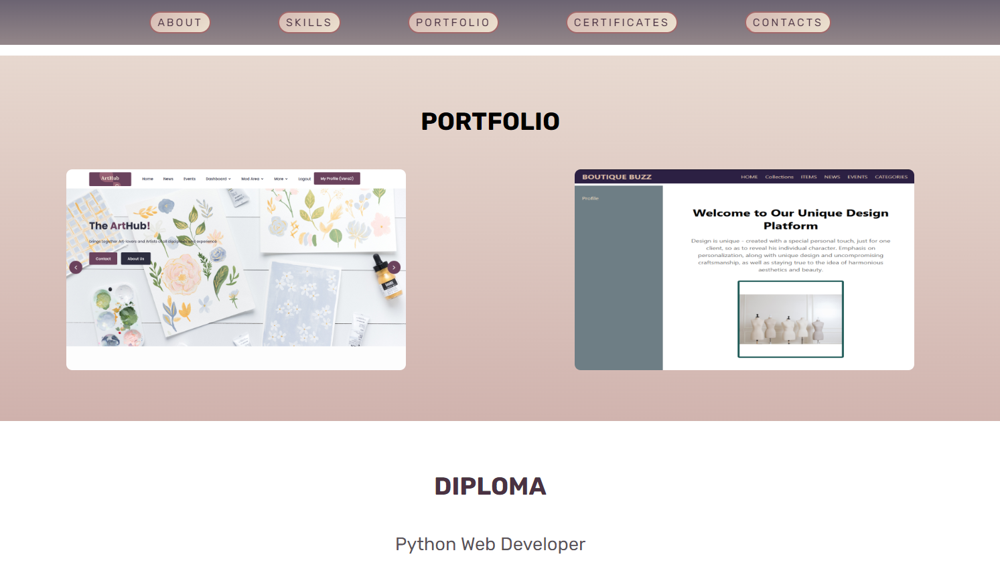

# My Portfolio

Welcome to my portfolio website! This repository contains the source code and assets for my personal portfolio.

## Overview

This portfolio showcases my skills, projects, and experience as a full-stack developer. It is designed to provide visitors with a glimpse into my expertise and the projects I've worked on.

## Table of Contents

- [Demo](#demo)
- [Features](#features)
- [Technologies Used](#technologies-used)
- [Installation](#installation)
- [Usage](#usage)
- [Screenshots](#screenshots)
- [Contact](#contact)

## Demo

[View Live Demo](https://veroniquedm.github.io/portfolio/) 

## Features

- **Responsive Design:** Ensures a seamless experience on devices of all sizes.
- **Project Showcase:** Highlights key projects with descriptions and links.
- **Skills Section:** Lists the technologies and skills I specialize in.
- **Certifications:** Showcasing my pursuit of knowledge and expertise through certifications.
- **Contact Information:** Provides ways to connect with me.


## Technologies Used

- HTML
- CSS
- JavaScript
- React

## Installation

1. Clone the repository: `git clone https://github.com/VeroniqueDM/portfolio`
2. Navigate to the project directory: `cd your-dir`
3. Install dependencies: `npm install`

## Usage

To run the portfolio website locally, use the following command:

```bash
npm start

```

## Screenshots
<!-- Add screenshots of your portfolio to showcase its design and functionality. -->
<!-- For example: -->



## Contact
 You can find me on LinkedIn -> [](www.linkedin.com/in/veronika-d-miteva)
 
 Feel free to reach out if you have any questions or would like to collaborate on a project.

<!-- Add any other contact information you'd like to share, such as email or social media links -->